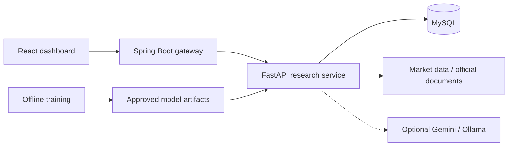

# FinTrack Market Intelligence

A public market-research dashboard for company analysis, global indices, news and experimental ML outlooks. No account or login is required.

[Open the application](https://tausifalam6879.github.io/FinTrack_Market_Intelligence/) · [System design](docs/system-architecture.md) · [Technical guide](docs/technical-guide.md)

## What you can do

- **Follow markets:** browse quotes, sectors, global indices, currencies and dated news.
- **Research companies:** search by name or ticker and inspect financial statements, ownership, dividends and analyst estimates.
- **Compare evidence:** compare 2–4 symbols, review benchmark/risk metrics and save a browser-local research list.
- **Explore ML outlooks:** see next-session probabilities, validation results and explanations.
- **Ask research questions:** receive evidence-based answers with document citations where available.
- **Inspect MLOps:** review model runs, drift, prediction outcomes and service health.

Quotes may be delayed. Cached data and snapshots are labelled; predictions are experiments, not guaranteed returns or trading instructions.

## System at a glance



The gateway validates public requests. FastAPI collects evidence and runs inference. MySQL stores research history and monitoring data. Training and model approval happen separately from user requests.

See [system design](docs/system-architecture.md) for the cloud layout, request flow, database tables and ML lifecycle.

## Technology

| Part | Technology |
| --- | --- |
| Interface | React, Vite |
| Public API gateway | Java 21, Spring Boot |
| Research and analytics | Python 3.12, FastAPI, pandas, scikit-learn |
| Storage | MySQL; Aiven in the cloud |
| Model development | Optional PyTorch comparator and MLflow tracking |
| Explanations | Optional Gemini / local Ollama; evidence-based fallback |
| Hosting | GitHub Pages and Google Cloud Run |

## Run locally

### Windows launcher

Install Python 3.12, Java 21, Node.js/npm and Ollama first. Then run **[Install FinTrack for Windows.cmd](Install%20FinTrack%20for%20Windows.cmd)** while online and follow the prompts.

The installer prepares the local setup and adds desktop/sign-in shortcuts. It is not a bundled installer for all prerequisite runtimes.

For an already configured checkout:

```powershell
.\start-local.ps1
```

Open [the local dashboard](http://127.0.0.1:5173/). The gateway uses port **8081** and the research API uses **8002**. Configure MySQL using the [database guide](docs/production-mysql.md).

Offline research needs previously stored data. A never-researched symbol may require an internet connection.

### Docker option

Copy `compose.env.example` to `.env`, replace the example passwords, then run:

```powershell
docker compose up --build
```

This starts the backend stack. Run the frontend separately:

```powershell
cd frontend
npm install
npm run dev:frontend
```

See the [technical guide](docs/technical-guide.md) for detailed setup, optional AI providers and training commands.

## Deployment

- GitHub Pages serves the frontend.
- Cloud Run hosts the gateway and research API.
- Aiven MySQL stores persistent research data.
- A Cloud Run job handles scheduled data operations; Cloud Scheduler triggers it on weekdays at **19:00 Asia/Kolkata**, as configured by the deployment script.
- Direct VPC egress and Cloud NAT provide a fixed outbound address for the database allowlist.

Cloud resources can incur costs independently of page visits. Review scaling and networking settings before deploying.

[Database deployment](docs/production-mysql.md) · [Portable deployment and restore](docs/PORTABLE_DEPLOYMENT.md)

## Project map

| Directory | Contents |
| --- | --- |
| `frontend/` | Dashboard, charts and API clients |
| `gateway-service/` | Public request validation and downstream resilience |
| `market-service/` | Data pipelines, inference, document retrieval and monitoring |
| `scripts/` | Deployment, snapshots, smoke tests and restore helpers |
| `docs/` | Architecture and operational guides |

## Verification

```powershell
# From frontend/
npm run build
npm run test:e2e
```

Backend, gateway and pipeline checks are described in the [technical guide](docs/technical-guide.md#continuous-integration). A frontend build alone does not verify the database or deployed services.

## Learn more

- [System design](docs/system-architecture.md) — components, request flow, MLOps and security.
- [Technical guide](docs/technical-guide.md) — deeper feature explanations and development commands.
- [Production MySQL](docs/production-mysql.md) — connectivity, TLS and maintenance.
- [Portable deployment](docs/PORTABLE_DEPLOYMENT.md) — moving the stack and restoring data.

This is a separate project from the Loan Verification System: it has no loan approval, personal finance accounts or money-transfer features.
