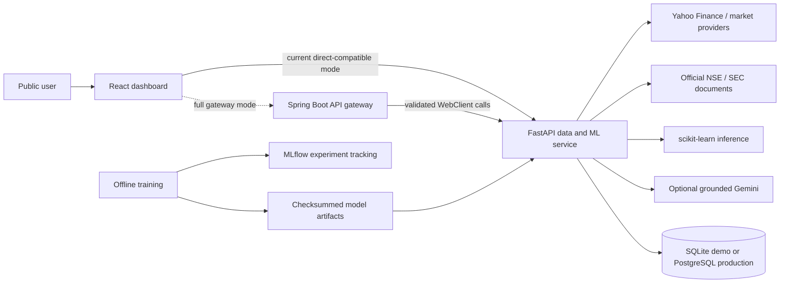
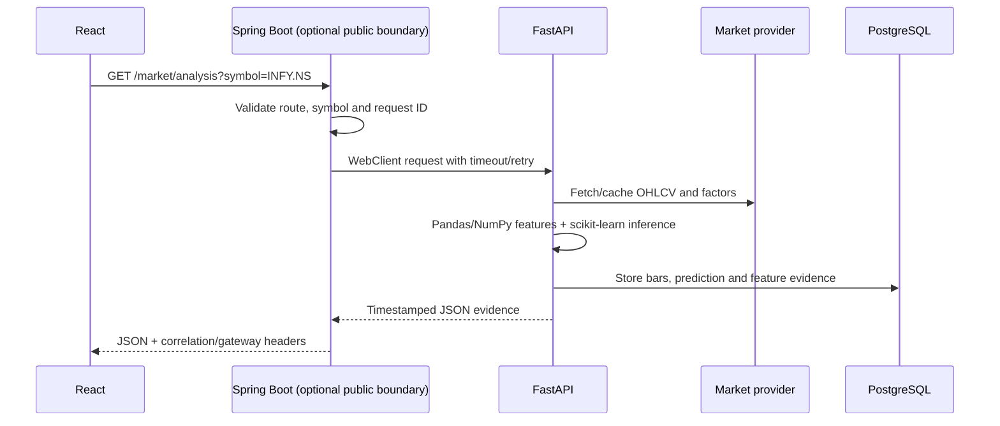
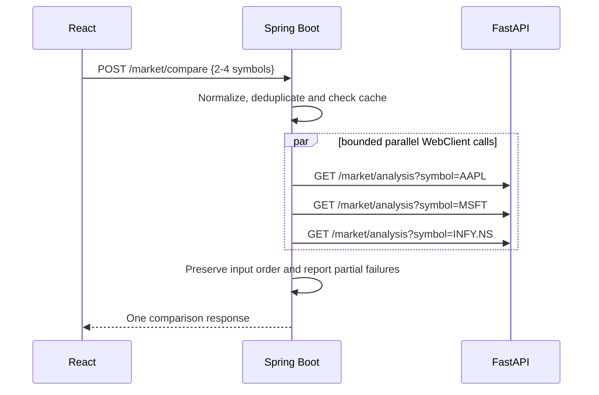
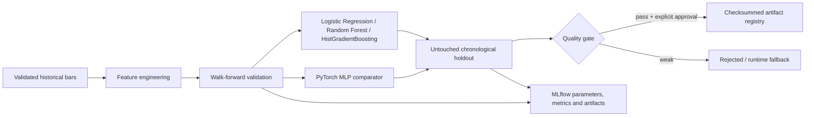

# FinTrack Market Intelligence architecture

## Production request paths

The repository supports two honest deployment modes with the same public API contract.

- GitHub Pages hosts only React static files and never receives a Gemini or database secret.
- The current public frontend can call FastAPI directly while the separate Spring service is deployed.
- In full gateway mode, the frontend base URL changes to Spring Boot. Route validation, request IDs, retry, circuit breaking, batch orchestration and Micrometer metrics happen there.
- FastAPI remains the Python data/ML boundary in both modes, so Python libraries do not leak into Java business code.

## Single-symbol analysis

## Multi-company batch comparison

When the frontend is connected directly to FastAPI, `POST /market/compare` performs the same bounded 2–4 symbol concurrency in Python. This compatibility route prevents deployment mode from changing the UI contract.

## Model-development path

MLflow is a developer/model-governance path, not part of every user request. Gemini explains verified output; it does not create numerical predictions or choose tools.

## Persistent data model

| Table | Purpose |
|---|---|
| `companies` | Dynamic researched-symbol universe and company metadata |
| `market_bars` | Validated historical OHLCV sessions |
| `ingestion_runs` | Pipeline execution provenance |
| `model_runs` | Dataset/model/holdout/quality-gate evidence |
| `predictions` | Prediction, serving model and later actual outcome |
| `model_feature_baselines` | Approved training reference distributions |
| `prediction_features` | Feature values used for a served prediction |
| `drift_snapshots` | Persisted PSI/drift decisions |
| `document_sources` | Verified report source and metadata |
| `document_chunks` | Page-aware RAG chunks and vectors/terms |
| `schema_migrations` | Applied idempotent schema versions |

SQLite is acceptable for local/demo mode. PostgreSQL is required for durable deployment, shared scheduled operations, reliable prediction outcomes and report indexes across redeploys.

## Resilience and observability

- Browser: last verified response cache, one bounded retry for idempotent/read-only calls, per-request timeout and bundled startup snapshot.
- Spring Boot: allowlisted routes, payload limits, WebClient timeout, one GET retry, circuit breaker, five-minute comparison cache and bounded four-call parallelism.
- FastAPI: provider/result caches, partial batch response, request latency/error aggregation and readiness checks.
- UI Model & MLOps view: request count, server error rate, average/P95 latency, Gemini accepted/fallback rate, database backend and dependency readiness.
- Telemetry stores aggregates only—no questions, symbols, IP addresses, accounts or personal finance data.

## Security boundaries

- No login and no personal portfolio data are collected.
- Gemini key stays only in the FastAPI environment; no `VITE_` secret exists.
- Public APIs expose read-only research routes. Training, model approval and arbitrary URL ingestion are not public.
- Symbols, query fields, body fields, request size and official-document hosts are validated.
- Database credentials are environment secrets and are never returned by health/operations endpoints.
